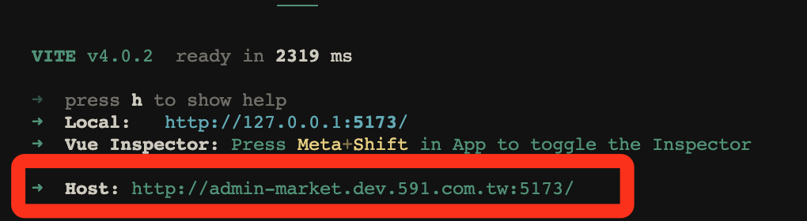
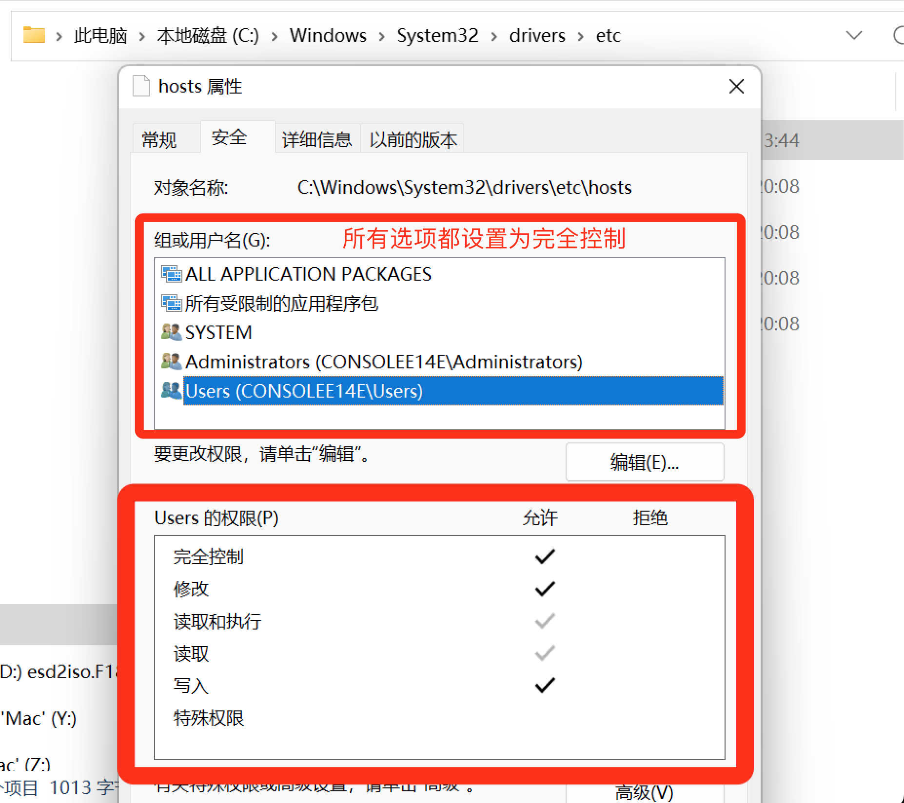

# Step：

```
pnpm install

pnpm play:dev or pnpm play:nuxt

```

# After resolving the proxy port issue, delete the repository.

# Ignore the following content

# unplugin-hosts

> `/etc/hosts` test git user & email

## 📓 背景

部分项目需要依赖Cookie(domain:.591.com.tw)才能正常运行,存在一些痛点:

  - 需要手动配置Hosts文件
  - 没有任何提示,新人不清楚

unplugin-hosts可以帮助我们自动配置Hosts文件,并给出相应提示.




## 📦 安裝

```bash
pnpm i unplugin-hosts
```

## 🎮 用法

### Vite

```ts

import Hosts from 'unplugin-hosts/vite'

export default defineConfig({
  plugins: [
    Hosts({
      ip: '127.0.0.1',
      host: 'hello.unplugin-hosts.com',
      // 支持同时设置多个hosts
      // host: ['hello.unplugin-hosts.com', 'word.unplugin-hosts.com'],
    }),
  ],
})
```

### Nuxt

```ts
// nuxt.config.ts
export default defineNuxtConfig({
  modules: [
    ['unplugin-hosts/nuxt', {
      ip: '127.0.0.1',
      host: 'hello.unplugin-hosts.com',
      // 支持同时设置多个hosts
      // host: ['hello.unplugin-hosts.com', 'word.unplugin-hosts.com'],
    }],
  ],
})
```


## 💡 Windows系统注意事项

  请确保本地Hosts文件已开启读写权限:



